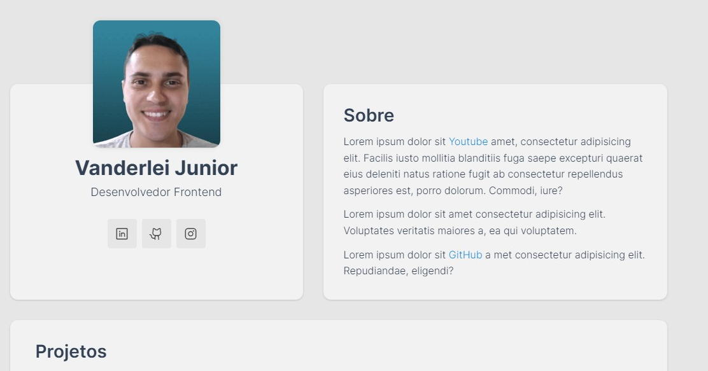
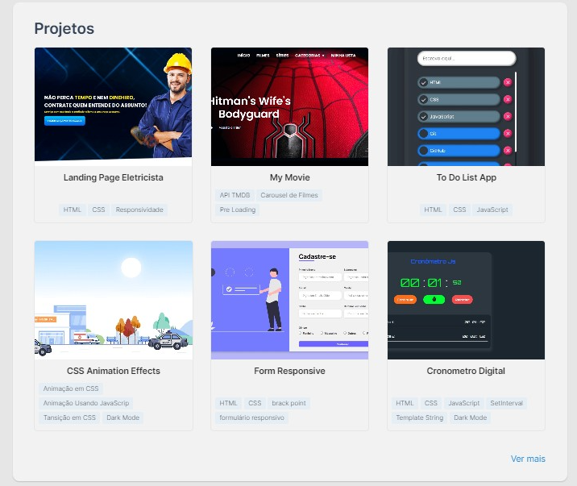

# Portfólio

## Índice
📋 

- <a href="#sobre-o-projeto">Sobre o Projeto</a>
- <a href="#objetivos">Objetivos</a>
- <a href="#funcionalidades">Funcionalidades</a>
- <a href="#captura-de-tela">Capitura de Tela</a>
- <a href="#linguagens-utilizadas">Linguagens utilizadas</a>
- <a href="#links-uteis">Links Uteis</a>
- <a href="#autor">Autor</a>

## Sobre o Projeto

Esse é o projeto

## Objetivos

- Ganhar mais conhecimento em JavaScript.
- Aprender mais sobre Eventos JavaScrip.
- Aprendeer pseudo-elementos em CSS.

## Funcionalidades

1. É possível escrever a tarefa que pracisa fazer e ao usar a tecla Enter do teclado a tarefa é registrada na lista.
2. Clicar na tarefa feita para marca-la como feita.
3. Excluir a tarefa.

## Captura de tela

📸

[⬆ Voltar ao topo](#índice) 

#### Portfólio

## Demonstração

Demontração :<a href="#">Portfólio</a>

## Linguagens utilizadas

📝
HTML | CSS | JavaScript

## Autor

🧑‍💻

### Links Uteis

- <a href="https://michalsnik.github.io/aos/">Animate On Scroll Library</a>
- <a href="https://metatags.io/">metatags.io</a>

### Vanderlei Junior

- <a href="https://github.com/VanderleiGeronimoJunior">GitHub</a>
- <a href="https://www.linkedin.com/in/vanderlei-junior-b9956686/">Linkedin</a>
- <a href="https://vanderleijunior.netlify.app/">Site</a>

[⬆ Voltar ao topo](#índice) 
